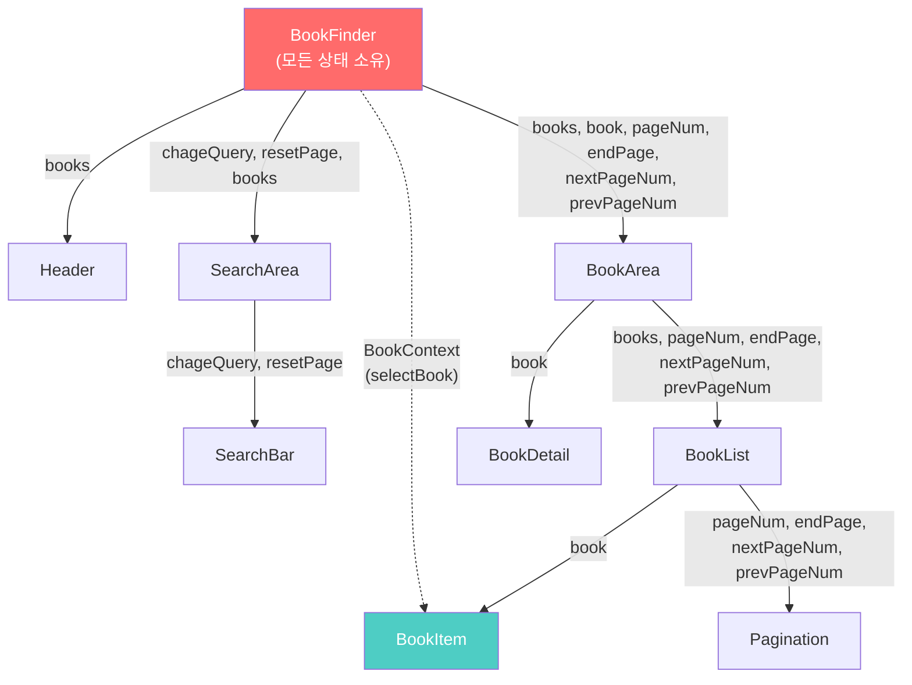
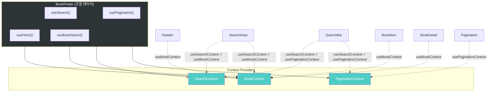

# BookFinder 프로젝트 구조 분석 & 리팩토링 설계

## 1. 프로젝트 개요

Kakao 도서 검색 API를 활용한 **도서 검색 웹 앱** (Vite + React 19 + TypeScript)

> [!NOTE]
> `config.json`은 API 키를 포함하며 `.gitignore`에 이미 등록되어 있어 Git에 노출되지 않습니다.

---

## 2. 현재 프로젝트 구조

```
src/
├── App.tsx                    # 진입 컴포넌트 (BookFinderPrac만 렌더)
├── App.css                    # body 전역 스타일
├── main.tsx                   # ReactDOM 렌더링
├── index.css                  # 전역 CSS
├── config.json                # 🔒 API KEY (gitignore 됨)
├── types/
│   └── Book.ts                # Book, Meta 타입 정의
├── contexts/
│   └── BookContext.ts         # selectBook만 전달하는 Context
├── hooks/
│   └── useFetch.ts            # API 호출 커스텀훅
└── components/
    ├── BookFinder.tsx          # ⭐ 핵심 컨테이너 (모든 상태 관리)
    ├── Header.tsx              # 헤더 (books가 없을 때만 표시)
    ├── Footer.tsx              # 푸터 (현재 주석 처리)
    ├── SearchArea.tsx          # 검색 영역 래퍼
    ├── SearchBar.tsx           # 검색 입력/버튼
    ├── BookArea.tsx            # 책 목록+상세 래퍼
    ├── BookList.tsx            # 책 목록 + 페이지네이션
    ├── BookItem.tsx            # 개별 책 항목 (Context 사용)
    ├── BookDetail.tsx          # 선택된 책 상세 정보
    ├── Pagination.tsx          # 페이지 이동 버튼
    └── css/                    # 컴포넌트별 CSS 파일들
```

---

## 3. 현재 데이터 흐름



---

## 4. 현재 코드의 문제점

### 4-1. 심각한 Prop Drilling

| Prop | 경로 | 깊이 |
|------|------|------|
| `books` | BookFinder → SearchArea (사용) | 1단계 |
| `books` | BookFinder → BookArea → BookList → BookItem | 3단계 |
| `pageNum, endPage` | BookFinder → BookArea → BookList → Pagination | 3단계 |
| `nextPageNum, prevPageNum` | BookFinder → BookArea → BookList → Pagination | 3단계 |
| `chageQuery, resetPage` | BookFinder → SearchArea → SearchBar | 2단계 |
| `book (selected)` | BookFinder → BookArea → BookDetail | 2단계 |

> [!WARNING]
> **BookArea**는 자신이 사용하지 않는 `pageNum`, `endPage`, `nextPageNum`, `prevPageNum`을 단순 전달만 하고 있습니다. 전형적인 prop drilling 패턴입니다.

### 4-2. BookContext가 너무 제한적

현재 `BookContext`는 `selectBook` 함수 **하나만** 전달합니다. 같은 맥락의 데이터(`selected`, `books` 등)는 여전히 props로 전달하고 있어, Context를 쓰는 의미가 반감됩니다.

### 4-3. useFetch 훅의 문제점

```typescript
// 현재 useFetch
export default function useFetch<T>(query: string, pageNum: number, endPoint: string) {
  // ...
  }, [query]);  // ⚠️ pageNum이 dependency에 빠져있음!
```

- **제네릭 `<T>`를 선언만 하고 사용하지 않음** — 실질적으로 `Book[]`에 하드코딩
- **`pageNum`이 `useEffect` dependency에 누락** — 페이지 변경 시 재요청 안 됨
- **loading/error 상태 없음** — UX 대응 불가
- **`endPoint`가 매번 전달됨** — 변하지 않는 상수를 파라미터로 받을 필요 없음

### 4-4. 기타 이슈

- `Header`의 조건부 렌더링: `!books || books.length === 0` → `!books`는 props 기반이라 항상 배열이므로 불필요
- `chageQuery` → 오타 (`changeQuery`가 올바름)
- `setEngPage` → 오타 (`setEndPage`가 올바름)
- BookDetail 하단에 주석 처리된 JSX 잔여물

---

## 5. useBookSearch 재검토: 3가지 대안 비교

### ❌ 안 A: useBookSearch 단일 훅 (기존안)

```typescript
function useBookSearch() {
  return { books, selectedBook, selectBook, isLoading, error,
           query, changeQuery,
           pageNum, endPage, nextPage, prevPage, resetPage };
  // 반환값 11개, 관심사 3개 혼재
}
```

| 장점 | 단점 |
|------|------|
| BookFinder에서 한 줄로 호출 | **SRP 위반** — 검색, 페이지, 선택 3가지 관심사 혼재 |
| 조합이 단순함 | 테스트하기 어려움 |
| | 훅 내부가 비대해짐 |
| | 페이지네이션만 수정해도 전체 훅에 영향 |

---

### ✅ 안 B: 관심사별 3개 훅 분리 (권장)

```typescript
// 각 훅이 하나의 관심사만 담당
function useSearch()     { return { query, changeQuery }; }
function usePagination() { return { pageNum, endPage, nextPage, prevPage, resetPage, setEndPage }; }
function useBookSelect() { return { selectedBook, selectBook }; }
```

BookFinder에서의 조합:

```typescript
function BookFinder() {
  const search = useSearch();
  const pagination = usePagination();
  const { books, isLoading, error, endPage } = useFetch(search.query, pagination.pageNum);
  const bookSelect = useBookSelect();

  // endPage를 pagination에 동기화
  useEffect(() => { pagination.setEndPage(endPage); }, [endPage]);

  return (
    <SearchContext.Provider value={search}>
      <BookContext.Provider value={{ books, ...bookSelect, isLoading, error }}>
        <PaginationContext.Provider value={pagination}>
          ...
        </PaginationContext.Provider>
      </BookContext.Provider>
    </SearchContext.Provider>
  );
}
```

| 장점 | 단점 |
|------|------|
| **각 훅이 SRP 준수** | BookFinder에서 조합 코드가 약간 늘어남 |
| 개별 테스트 용이 | |
| 다른 프로젝트에서 재사용 가능 | |
| 하나를 수정해도 다른 훅에 영향 없음 | |

---

### ⚠️ 안 C: 2개로 분리 (중간안)

```typescript
function useBookApi(query, pageNum)  { return { books, endPage, isLoading, error }; }  // fetch + 데이터
function useBookSelect()             { return { selectedBook, selectBook }; }           // 선택
// query, pageNum은 BookFinder에서 직접 useState
```

| 장점 | 단점 |
|------|------|
| 가장 단순한 구조 | query/pagination 로직이 BookFinder에 남음 |
| 이해하기 쉬움 | prop drilling 해결 효과가 안 B보다 약함 |

---

### 권장: 안 B (관심사별 3개 훅 분리)

> [!IMPORTANT]
> **안 B를 권장하는 이유**: 각 훅이 독립적으로 테스트·재사용 가능하고, BookFinder의 조합 코드가 약간 늘어나지만 **각 줄이 무엇을 하는지 명확히 읽힙니다.** "한 훅이 한 가지 일만 한다"는 원칙에 가장 부합합니다.

---

## 6. 최종 설계안 (안 B 기반)

### 6-1. Context 설계 (3개)

#### ① `SearchContext` [NEW]

```typescript
type SearchContextType = {
  query: string;
  changeQuery: (q: string) => void;
};
```

#### ② `BookContext` [확장]

```typescript
type BookContextType = {
  books: Book[];
  selectedBook: Book | null;
  selectBook: (book: Book) => void;
  isLoading: boolean;
  error: string | null;
};
```

#### ③ `PaginationContext` [NEW]

```typescript
type PaginationContextType = {
  pageNum: number;
  endPage: boolean;
  nextPage: () => void;
  prevPage: () => void;
  resetPage: () => void;
};
```

---

### 6-2. 커스텀훅 설계 (6개)

#### 비즈니스 로직 훅

| 훅 | 역할 | 반환값 |
|----|------|--------|
| `useFetch<T>` [개선] | 범용 API 호출 | `{ data, isLoading, error }` |
| `useSearch` [NEW] | 검색어 상태 관리 | `{ query, changeQuery }` |
| `usePagination` [NEW] | 페이지 상태 관리 | `{ pageNum, endPage, nextPage, prevPage, resetPage, setEndPage }` |

#### Context 소비 훅 (null 체크 보일러플레이트 제거)

| 훅 | 역할 |
|----|------|
| `useBookContext` [NEW] | BookContext 안전 소비 |
| `useSearchContext` [NEW] | SearchContext 안전 소비 |
| `usePaginationContext` [NEW] | PaginationContext 안전 소비 |

---

### 6-3. 리팩토링 후 데이터 흐름



---

### 6-4. 컴포넌트 변경 요약

| 컴포넌트 | 현재 | 리팩토링 후 |
|----------|------|------------|
| **BookFinder** | 모든 상태 관리 + 함수 정의 | 3개 훅 호출 → 3개 Provider 래핑 |
| **Header** | `books` prop | `useBookContext()` |
| **SearchArea** | `chageQuery, resetPage, books` prop | `useSearchContext()` + `useBookContext()` |
| **SearchBar** | `chageQuery, resetPage` prop | `useSearchContext()` + `usePaginationContext()` |
| **BookArea** | 6개 prop pass-through | **props 0개**, 레이아웃만 |
| **BookList** | 5개 prop | `useBookContext()` |
| **BookItem** | `book` prop + 수동 Context | `book` prop 유지 + `useBookContext()` |
| **BookDetail** | `book` prop | `useBookContext()` |
| **Pagination** | 4개 prop | `usePaginationContext()` |

---

### 6-5. 파일 변경 계획

```
src/
├── types/
│   └── Book.ts                        # 변경 없음
├── contexts/
│   ├── BookContext.ts                  # [MODIFY] 타입 확장
│   ├── SearchContext.ts               # [NEW]
│   └── PaginationContext.ts           # [NEW]
├── hooks/
│   ├── useFetch.ts                    # [MODIFY] 범용화 + loading/error
│   ├── useSearch.ts                   # [NEW] 검색어 상태
│   ├── usePagination.ts              # [NEW] 페이지 상태
│   ├── useBookContext.ts              # [NEW] Context 안전 소비
│   ├── useSearchContext.ts            # [NEW] Context 안전 소비
│   └── usePaginationContext.ts        # [NEW] Context 안전 소비
└── components/
    ├── BookFinder.tsx                  # [MODIFY] 훅 조합 + Provider 래핑
    ├── Header.tsx                      # [MODIFY] props → Context
    ├── SearchArea.tsx                  # [MODIFY] props → Context
    ├── SearchBar.tsx                   # [MODIFY] props → Context
    ├── BookArea.tsx                    # [MODIFY] props 제거
    ├── BookList.tsx                    # [MODIFY] props → Context
    ├── BookItem.tsx                    # [MODIFY] 보일러플레이트 → useBookContext
    ├── BookDetail.tsx                  # [MODIFY] props → Context
    └── Pagination.tsx                  # [MODIFY] props → Context
```

---

## 7. 추가 개선 제안 (선택사항)

| 항목 | 설명 |
|------|------|
| 오타 수정 | `chageQuery` → `changeQuery`, `setEngPage` → `setEndPage` |
| 환경변수 사용 | `config.json` 대신 `.env` + `import.meta.env.VITE_KAKAO_API_KEY` 사용 권장 |
| Enter 키 검색 | SearchBar에서 Enter 키 입력 시 검색 실행 |
| 에러/로딩 UI | `isLoading` 스피너, `error` 메시지 표시 컴포넌트 추가 |

---

## Open Questions

1. **BookItem의 `book` prop**: 리스트에서 map으로 개별 book을 전달하는 것은 Context보다 prop이 자연스럽습니다. 이대로 유지할까요?
2. **추가 개선 제안**(환경변수, Enter 키 검색, 로딩/에러 UI)도 이번 리팩토링에 포함할까요?
